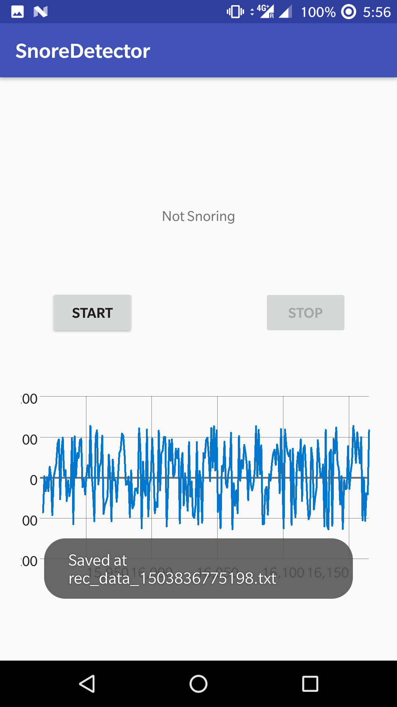
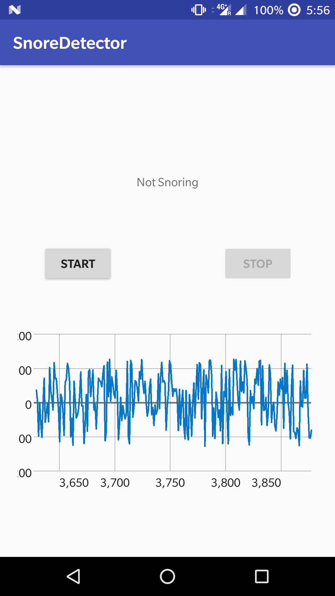
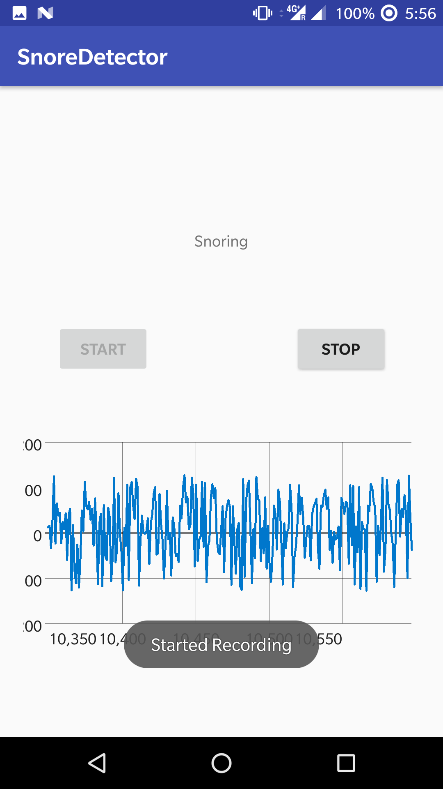

# SnoreDetector 

This repository contains the source code for the Snore Detector (Part 3).

This app is created for an assignment of Programmable and Embedded Systems.

This app was built using [Android Studio 3.0](https://developer.android.com/studio/preview/index.html) and Gradle 4.1

Ph No. +91-7076607344

## Screenshot:

## Dependencies Used
[GraphView 4.2.1](http://www.android-graphview.org/)
>https://mvnrepository.com/artifact/com.jjoe64/graphview/4.2.1

## Author

**Manne Naga Nithin** - [nithinmanne](https://github.com/nithinmanne)

14EE10026

Ph No. +91-7076607344

## License

* [Apache Version 2.0](http://www.apache.org/licenses/LICENSE-2.0.html)
